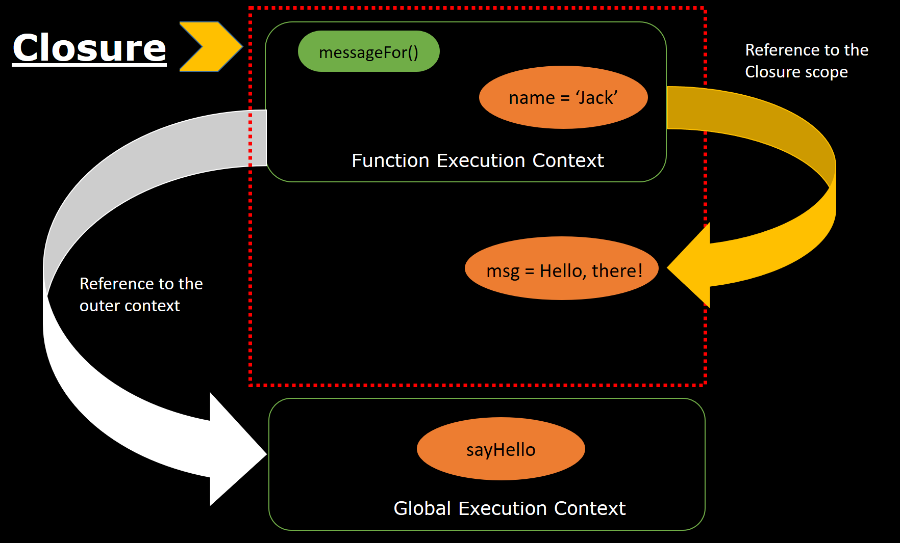

# Closure
#### Замыкание (Closure) – это механизм в JavaScript, при котором функция "запоминает" область видимости, в которой она была создана, даже после того, как эта область завершила выполнение.

## 📌 Ключевые свойства замыкания
#### Функция может использовать переменные из внешней функции, даже если внешняя функция уже закончила выполнение.
#### Эти переменные не удаляются из памяти, пока на замыкание есть ссылки.
#### Замыкания помогают скрывать данные и создавать приватные переменные.
## 1️⃣ Как работает замыкание?
#### Каждый раз, когда в JavaScript создаётся функция, она запоминает контекст, в котором была создана.

## Вот как это происходит:

#### Когда вызывается внешняя функция, создаётся её лексическое окружение (пространство с переменными).
#### Если внутри есть внутренняя функция, она получает доступ к переменным внешней функции.
#### Даже после завершения внешней функции, её переменные не удаляются, если на них ссылается внутренняя функция.
## 2️⃣ Зачем использовать замыкание?
#### 🔹 Инкапсуляция – можно создать переменные, которые невозможно изменить извне.
#### 🔹 Счётчики и таймеры – удобно хранить состояние между вызовами функций.
#### 🔹 Создание фабрик функций – удобно передавать настройки в функцию один раз.
## 3️⃣ Важные моменты про замыкания
### 📌 1. Замыкание держит переменные в памяти
## Если есть ссылки на замыкание, JavaScript не удаляет его из памяти. Это может привести к утечкам памяти, если забыть очистить переменные.

### 📌 2. Замыкания создаются автоматически
#### Каждый раз, когда объявляется новая функция, она автоматически запоминает область видимости, в которой была создана.

### 📌 3. Глобальные переменные не нужны
#### Вместо хранения данных в глобальной области, можно использовать замыкания для ограничения области видимости переменных.

## 4️⃣ Итог
### ✅ Замыкание – это функция, которая "помнит" переменные внешней функции.
### ✅ Используется для инкапсуляции, счётчиков, фабрик функций и обработки событий.
### ✅ Может привести к утечкам памяти, если не очищать ссылки на замыкание.

#  😃
